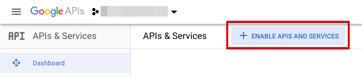
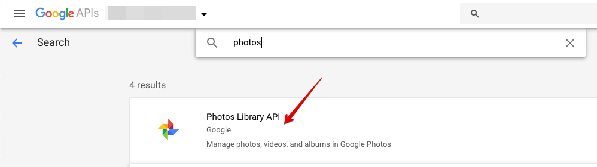
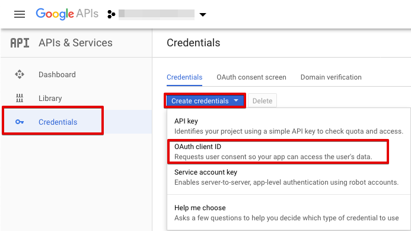
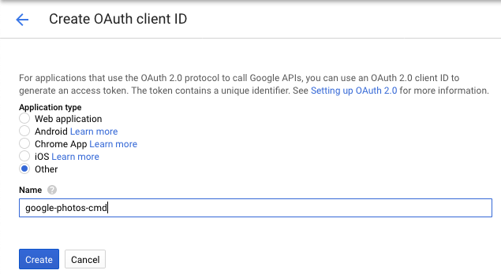
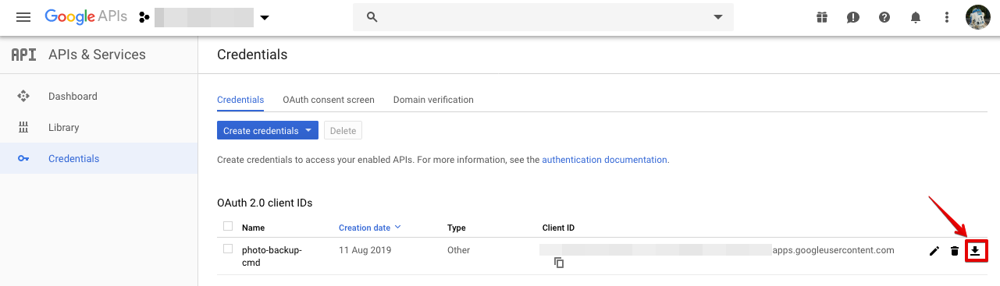

# Google Photos Sync/Backup

This Go program downloads a (filtered) collection of a Google Photos account into a local directory
hierarchy.

Unfortunately, Google does not offer any simple solution to just download photos by certain filters,
so this tool fills this gap.

Luckily, Google Photos comes with a REST API, which allows querying and downloading the Photos library.
This script is a very simple approach to fetch your Google Photos automatically.

**Note**: This is a very first draft of the script. It is NOT tested thoroughly, and it is NOT implemented in a secure and stable way! Be aware!

## Requirements

* The Go tools, if you want to compile it by yourself
* A Google Photos account
* A Google Photos account and access to the Google Developer Console (https://console.developers.google.com/)

## Setup

### Step 1: Enable the Photos API

You need to enable the Photos API in order to use it.

1. Log in to https://console.developers.google.com/
2. In the Dashboard, click on "Enable APIs and Services":<br/>
   
3. Search for "Photos", and select the Photos entry:<br />
   
4. Click the "Enable API" button

Return to the Developer Console Dashboard.

### Step 2: Create a Google OAuth 2.0 Client ID

The Google Photos API only works with OAuth 2.0. You need to create an OAuth 2.0 Client ID and download your secret credentials
in order to use them with the pyhton tool.

1. In the Developer Console, click "Credentials" in the left menu, then select "Create Credentials" &gt; "OAuth Client ID":<br/>
   
2. Select "Other" in the Create OAuth client ID menu, and provide a name. This name is not important for the application, just for you to
   recognize it later.<br/>
   
3. Click "Create".
4. Back in the Dashboard's "Credentials" menu, click the download button on the newly created client it. The JSON file you get contains
   the secret client tokens. KEEP IT IN A SAFE PLACE, it contains the keys that allow access the Google Photos library! <br />
   


### Step 3: Build the program

```bash
$ git clone git@github.com:bylexus/gphotos-sync.git
$ cd gphotos-sync
$ go build
```

## Usage

Once the setup is complete, you start the tool with the following command:

```bash
$ ./gphotos-sync /path/to/photo/backup/folder
```

If you start the tool for the first time, it initiates the Google Authentication workflow:

1. You will be asked for your Google Client ID and Google Client Secret. Enther those values,
   which you can find in the Developer Console <https://console.cloud.google.com>
2. Your Browser will start and asks you for your Google permissions for the gphotos-sync app
3. After the authentication was successful, you can close the browser and the command line
   tool should resume its operation.

***NOTE***

The Google Authentication information is stored locally in a settings file in the User's config directory (`secrets.json`). 
This file contains sensitive information (your authentication token). Do NOT share this file!

If all goes well, the tool begins to transfer your photos. Enjoy!

### Command line flags

The following command line flags are interpreted to configure the sync:

**`--date=YYYY[-MM[-DD]]`**:

Filter by date. The date is either a full date representing a specific day, or a part of it: So `2023` will sync the whole year, while `2023-04` will sync only April, 2023.

## Limitations

* Downloaded photos include the original EXIF data, EXCEPT the location data: This seems to be a Google Photos API limitation, officially enforced by Google.
  To this moment, there seems to be no solution around that.

## Notes

* This tool is in an early experimental stage. Do NOT expect it to work flawlessly.
* I have not tested it over a longer period of time (e.g. until the client tokens expire). I do not yet know what happens then.
* I will implement some additional config params in the future, see Wishlist below

## Wishlist

* multiple parallel download connections
* credentials store encryption
* output folder configuration: folder level generation by template (e.g. "{year}/{month}")
* Filters: by year, by date range
* Skip already downloaded files (e.g. check by filename, change date (?))
* configure batch size (today: fix to 100 photos per batch)
* Extract photo metadata from google api and embed them as EXIF data
* Extract GPS data: Unfortunately, it seems that those are NOT available through the Photos API. It _may_ be a possibility to
  use Google Drive: https://www.labnol.org/code/20059-image-exif-and-location


If you have any more ideas what this tool should be able to do, please drop me an issue or a note.

(c) 2023 <alex-gsync@alexi.ch>